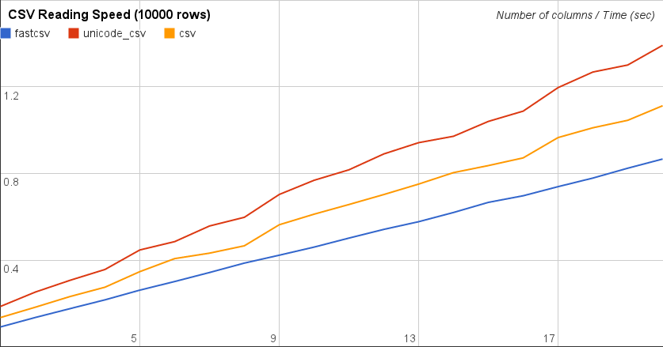
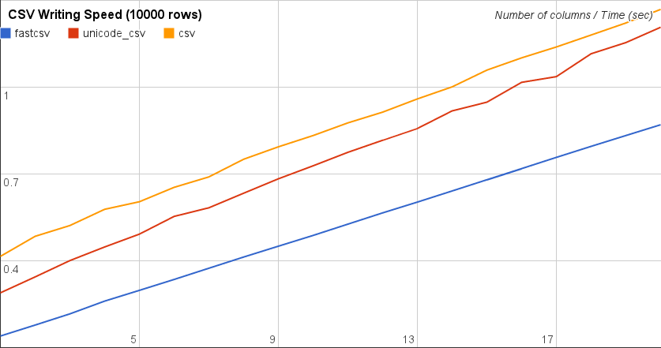

=======
fastcsv
=======

fastcsv is a module that treats CSV files. Its reading/writing speed is faster
than standard csv module.

.. toctree::
   :maxdepth: 1

   api

Benchmark
=========

(Average of 10 times trial. Measured on Python 2.7.3, Intel(R) Core(TM)
i7-3770K CPU @ 3.50GHz, tmpfs)

Why not use the standard csv module?
====================================

csv_ module cannot treat unicode string, so if you want to properly treat CSV
files that are encoded non-ascii encoding you have to wrap it to re-code the
file, which is described in its documentation. For example, if you want to
read cp932 encoded CSV file, you have to re-code like this:

.. blockdiag::

   blockdiag {
     byteio -> "cp932 decoder" -> "utf8 encoder"-> "csv.reader" -> "utf8 decoder"
     row <- "utf8 decoder"
     group{
       "cp932 decoder"
       "utf8 encoder"
       "utf8 decoder"
     }
   }

csvwrapper_ will do this re-coding for you. But its I/O speed is about 10
times decreased.

To overcome this speed drawback, csv module has been forked and changed to
use TextIO, which is open-sourced as unicode_csv_. unicode_csv uses same
algorithm with csv, and this algorithm can be improved, and the improved
version is fastcsv.

.. _csv: http://docs.python.org/2/library/csv.html
.. _csvwrapper: https://github.com/draftcode/csvwrapper
.. _unicode_csv: https://github.com/draftcode/unicode_csv

Indices and tables
==================

* :ref:`genindex`
* :ref:`modindex`
* :ref:`search`

